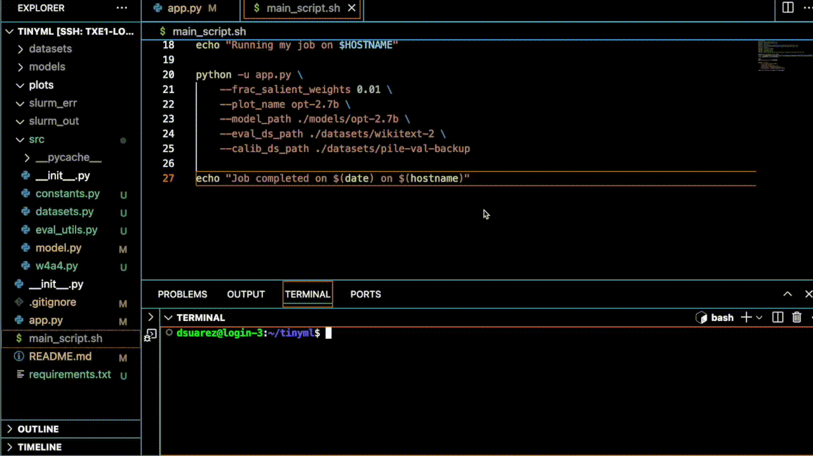

# tinyml_project
Repository for TinyML project (course # is 6.5940).

We explore mixed-precision weight 4-bit, activation 4-bit quantization (W4A4) for LLM compression and acceleration.

Activation quantizations are performed dynamically, weight quantizations are done according to an importance ranking computed from activation magnitudes.

The fraction of salient weight channels preserved is kept at a fixed default value of 0.01. As shown in Activation-aware Weight Quantization (AWQ) by Lin et al. (2023) [1], retaining 1% of the salient weight channels at original precision significantly reduces quantization error.

We aim to understand how quantization of the activations affects quantization error. Here, the fraction of activation channels (corresponding to salient weights) that are preserved is varied across the range [0.1,0.2,...,0.9].

A push-the-button script is included below for ease of use. Note that the SLURM environment uses a slightly different workflow (as shown in the demo).

(Lab 4 of 6.5940 proved to be especially helpful and useful here.)

## Push-the-button script: 

To use mixed-precision W4A4 quantization on the model, run the following command:

```
python -u app.py \
    --frac_salient_weights <fraction of salient weights preserved> \
    --plot_name <name of plot> \
    --model_path <path to model> \
    --eval_ds_path <path to eval. dataset> \
    --calib_ds_path <path to calib dataset>
```

Arguments:
- `--frac_salient_weights`: Fraction of salient weight channels to preserve during quantization (e.g., `0.01` for preserving 1% of weights).
- `--plot_name`: Name for the output plot (e.g., `opt-2.7b`). Plot saved in the `./plots/` directory.
- `--model_path`: Path to the pretrained model (e.g., `./models/opt-2.7b`). Model should be pre-downloaded.
- `--eval_ds_path`: Path to the evaluation dataset (e.g., `./datasets/wikitext-2`). Dataset should be pre-downloaded.
- `--calib_ds_path`: Path to the calibration dataset (e.g., `./datasets/pile-val-backup`). Dataset should also be pre-downloaded.

## Demo:



## References:

[1] Lin, S., Wang, Y., Wang, X., Wang, Z., & Yang, H. (2023). AWQ: Activation-Aware Weight Quantization for LLMs. In H. Larochelle, G. Ranzato, R. Hadsell, M. F. Balcan, & H. Lin (Eds.), *Advances in Neural Information Processing Systems 36*.
